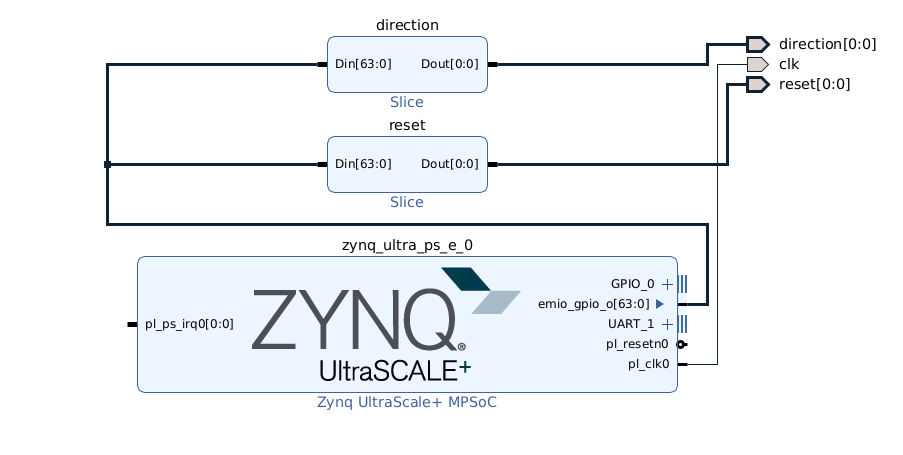

# Johnson Counter test bitstream

## Overview

This is a basic project to test the vivado flow that targets the `ZCU111` board.
It contains the following files:

* `johnson_counter.sv` - A system verilog implementation of a johnson counter.
* `johnson_counter_test.cc` - A verilator test for `johnson_counter.sv`
* `io_constraints.xdc` - A set of basic IO constraints to attach LEDs.
* `zcu111_gpio.tcl` - A block design to include into the project.
* `johnson_counter_top.sv` - A top level module to put everything together.
* `xilinx_env.sh` - A shell script to source vivado settings and get the license.

## ZCU111 GPIO Block design



The block design instantiates the Zynq IP core. It creates a 100MHz clock and provides 2 gpios. Direction is attached to `emio_gpio_o[0]` and reset is attached to `emio_gpio_o[1]`.

## Xilinx Environment

`xilinx_env.sh` is used to define where vivado is installed and point to the license
server. It contains:

```bash
# This is needed as vivado complains about not finding tcl store if HOME is not defined.
export HOME=/tmp
# Source the settings at your install location.
source /opt/xilinx/Vivado/2021.2/settings64.sh
# Provide details of the license server. If running locally, use this.
export XILINXD_LICENSE_FILE=2100@localhost
```

## Build instructions

To build a bitstream, run `bazel build //vivado/tests:johnson_counter_vivado`.
This will create `bazel-bin/vivado/tests/johnson_counter_vivado.bit`.

The LEDs should all turn on, 1 by 1 and then turn off 1 by 1.
